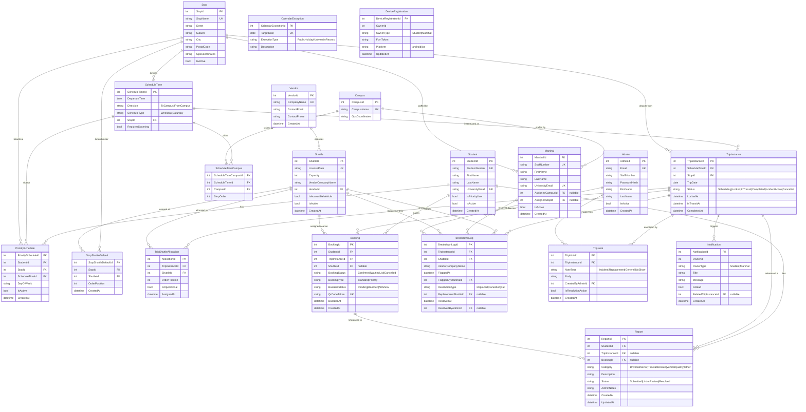

```mermaid
erDiagram
    %% ===================== PEOPLE =====================
    Student {
        int StudentId PK
        string StudentNumber UK
        string FirstName
        string LastName
        string UniversityEmail UK
        bool IsPriorityUser
        bool IsActive
        datetime CreatedAt
    }

    Marshal {
        int MarshalId PK
        string StaffNumber UK
        string FirstName
        string LastName
        string UniversityEmail UK
        int AssignedCampusId FK "nullable"
        int AssignedStopId FK "nullable"
        bool IsActive
        datetime CreatedAt
    }

    Admin {
        int AdminId PK
        string Email UK
        string StaffNumber
        string PasswordHash
        string FirstName
        string LastName
        bool IsActive
        datetime CreatedAt
    }

    %% ===================== LOCATIONS & SCHEDULING =====================
    Campus {
        int CampusId PK
        string CampusName UK
        string GpsCoordinates
    }

    Stop {
        int StopId PK
        string StopName UK
        string Street
        string Suburb
        string City
        string PostalCode
        string GpsCoordinates
        bool IsActive
    }

    ScheduleTime {
        int ScheduleTimeId PK
        time DepartureTime
        string Direction "ToCampus|FromCampus"
        string ScheduleType "Weekday|Saturday"
        int StopId FK
        bool RequiresScanning
    }

    ScheduleTimeCampus {
        int ScheduleTimeCampusId PK
        int ScheduleTimeId FK
        int CampusId FK
        int StopOrder
    }

    CalendarException {
        int CalendarExceptionId PK
        date TargetDate UK
        string ExceptionType "PublicHoliday|UniversityRecess"
        string Description
    }

    PrioritySchedule {
        int PriorityScheduleId PK
        int StudentId FK
        int StopId FK
        int ScheduleTimeId FK
        string DayOfWeek
        bool IsActive
        datetime CreatedAt
    }

    %% ===================== FLEET =====================
    Vendor {
        int VendorId PK
        string CompanyName UK
        string ContactEmail
        string ContactPhone
        datetime CreatedAt
    }

    Shuttle {
        int ShuttleId PK
        string LicensePlate UK
        int Capacity
        string VendorCompanyName
        int VendorId FK
        bool IsAccessibleVehicle
        bool IsActive
        datetime CreatedAt
    }

    StopShuttleDefault {
        int StopShuttleDefaultId PK
        int StopId FK
        int ShuttleId FK
        int OrderPosition
        datetime CreatedAt
    }

    %% ===================== TRIPS =====================
    TripInstance {
        int TripInstanceId PK
        int ScheduleTimeId FK
        int StopId FK
        date TripDate
        string Status "Scheduling|Locked|InTransit|Completed|IncidentActive|Cancelled"
        datetime LockedAt
        datetime InTransitAt
        datetime CompletedAt
    }

    TripShuttleAllocation {
        int AllocationId PK
        int TripInstanceId FK
        int ShuttleId FK
        int OrderPosition
        bool IsOperational
        datetime AssignedAt
    }

    Booking {
        int BookingId PK
        int StudentId FK
        int TripInstanceId FK
        int ShuttleId FK "nullable"
        string BookingStatus "Confirmed|WaitingList|Cancelled"
        string BookingType "Standard|Priority"
        string BoardedStatus "Pending|Boarded|NoShow"
        string QrCodeToken UK
        datetime BoardedAt
        datetime CreatedAt
    }

    BreakdownLog {
        int BreakdownLogId PK
        int TripInstanceId FK
        int ShuttleId FK
        string VendorCompanyName
        datetime FlaggedAt
        int FlaggedByMarshalId FK
        string ResolutionType "Replaced|Cancelled|null"
        int ReplacementShuttleId FK "nullable"
        datetime ResolvedAt
        int ResolvedByAdminId FK "nullable"
    }

    TripNote {
        int TripNoteId PK
        int TripInstanceId FK
        string NoteType "Incident|Replacement|General|NoShow"
        string Body
        int CreatedByAdminId FK
        bool IsResolutionAction
        datetime CreatedAt
    }

    Report {
        int ReportId PK
        int StudentId FK
        int TripInstanceId FK "nullable"
        int BookingId FK "nullable"
        string Category "DriverBehavior|TimetableIssue|VehicleQuality|Other"
        string Description
        string Status "Submitted|UnderReview|Resolved"
        string AdminNotes
        datetime CreatedAt
        datetime UpdatedAt
    }

    %% ===================== MESSAGING / DEVICES =====================
    Notification {
        int NotificationId PK
        int OwnerId
        string OwnerType "Student|Marshal"
        string Title
        string Message
        bool IsRead
        int RelatedTripInstanceId FK "nullable"
        datetime CreatedAt
    }

    DeviceRegistration {
        int DeviceRegistrationId PK
        int OwnerId
        string OwnerType "Student|Marshal"
        string FcmToken
        string Platform "android|ios"
        datetime UpdatedAt
    }

    %% ===================== RELATIONSHIPS =====================
    %% -- People to assignments / schedules
    Campus ||--o{ Marshal : "staffed by"
    Stop   ||--o{ Marshal : "staffed by"
    Student ||--o{ PrioritySchedule : "has"
    Student ||--o{ Booking : "makes"
    Student ||--o{ Report : "files"

    %% -- Scheduling
    Stop ||--o{ ScheduleTime : "defines"
    ScheduleTime ||--o{ ScheduleTimeCampus : "visits"
    Campus ||--o{ ScheduleTimeCampus : "visited by"
    ScheduleTime ||--o{ PrioritySchedule : "slot for"
    Stop ||--o{ PrioritySchedule : "boards at"

    %% -- Fleet
    Vendor ||--o{ Shuttle : "operates"
    Stop   ||--o{ StopShuttleDefault : "default roster"
    Shuttle ||--o{ StopShuttleDefault : "rostered at"

    %% -- Trips (hub)
    ScheduleTime ||--o{ TripInstance : "instantiated as"
    Stop         ||--o{ TripInstance : "departs from"
    TripInstance ||--o{ TripShuttleAllocation : "convoy of"
    Shuttle      ||--o{ TripShuttleAllocation : "allocated to"
    TripInstance ||--o{ Booking : "booked on"
    Shuttle      ||--o{ Booking : "assigned seat on"
    TripInstance ||--o{ TripNote : "annotated by"
    Admin        ||--o{ TripNote : "authored"
    TripInstance ||--o{ Report : "referenced in"
    Booking      ||--o{ Report : "referenced in"

    %% -- Breakdowns
    TripInstance ||--o{ BreakdownLog : "incident on"
    Shuttle      ||--o{ BreakdownLog : "flagged"
    Marshal      ||--o{ BreakdownLog : "reported by"
    Shuttle      ||--o{ BreakdownLog : "replacement for"
    Admin        ||--o{ BreakdownLog : "resolved by"

    %% -- Messaging
    TripInstance ||--o{ Notification : "triggers"
```

